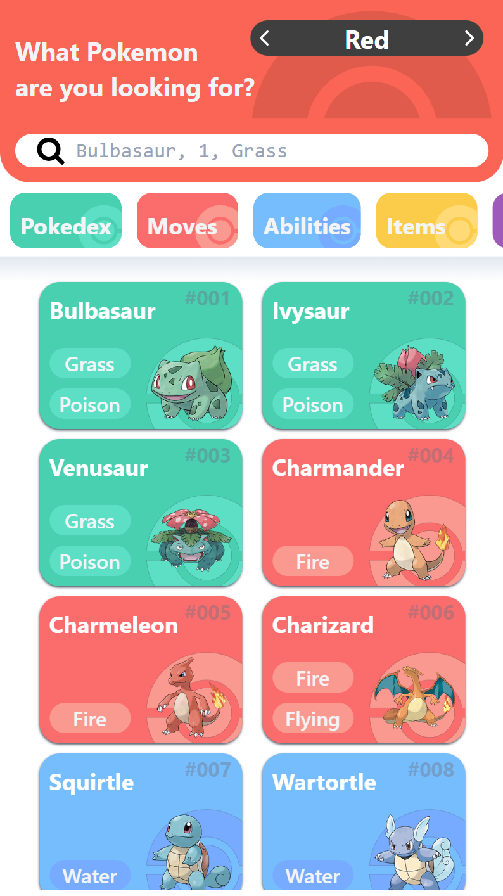
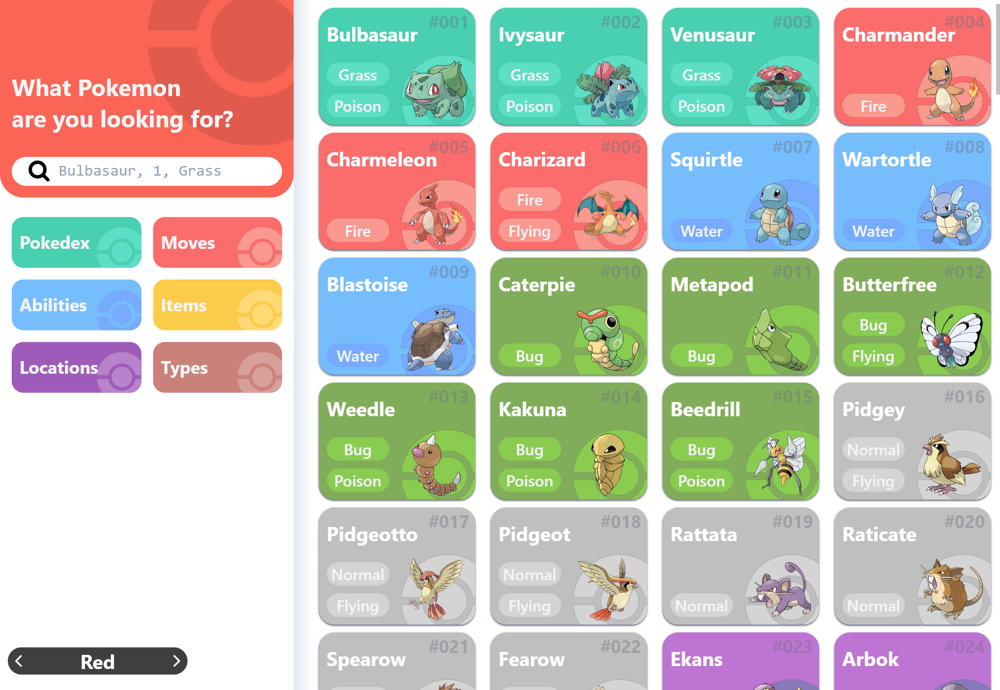

# React + TypeScript + Vite + Tailwind

Pokedex API consumer that uses the Graphql part of pokeApi to achieve a reduced packet transfer system

## github pages deployment: <https://github.com/Angel-Mario/poke-api-consumer/deployments/github-pages>

## Screenshots

**Mobile**

**Desktop**

